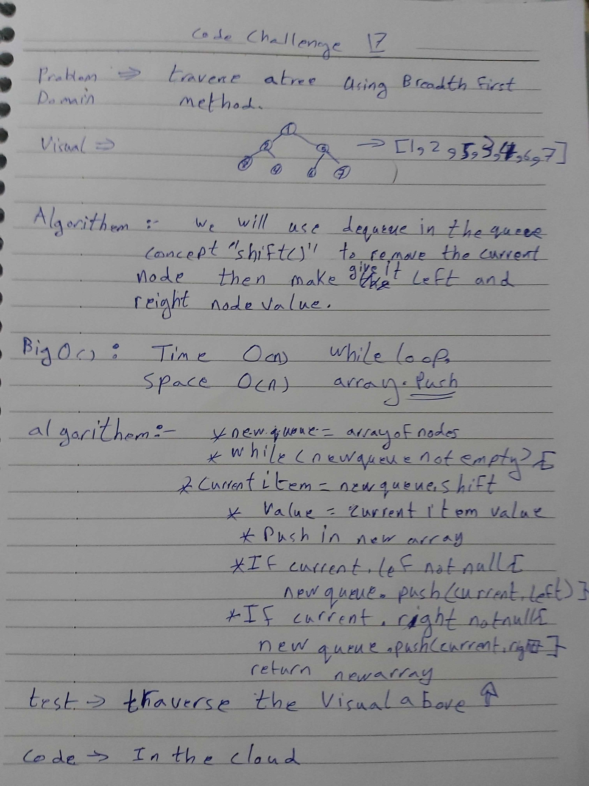

# data-structures-and-algorithms
Code challenges 401 - Data-Structures

# Breadth-first Traversal-17
This is about how to utilize breadth-first-tree data-structure method.
## Challenge
Use queue concept in a tree.
## Approach & Efficiency
Learn more about how the tree Data-Structures traverse are realated to each other.

## [Action flow](https://github.com/Abdallah-401-advanced-javascript/data-structures-and-algorithms/pull/20/checks?check_run_id=748532367)

## Solution

