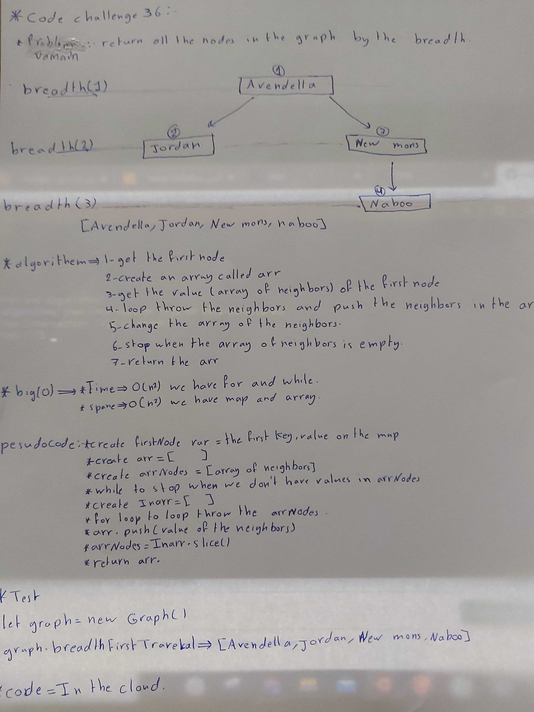

# data-structures-and-algorithms
Code challenges 401 - Data-Structures

# Implement a breadth-first traversal on a graph class-36
This is about how to implement a breadth-first traversal on a graph.
## Challenge
Solve the challenge.
## Approach & Efficiency
This is about how to implement a breadth-first traversal on a graph.

## [Action flow](https://github.com/Abdallah-401-advanced-javascript/data-structures-and-algorithms/pull/20/checks?check_run_id=748532367)

## Solution
<!-- [BLOG](./BLOG.md) -->

