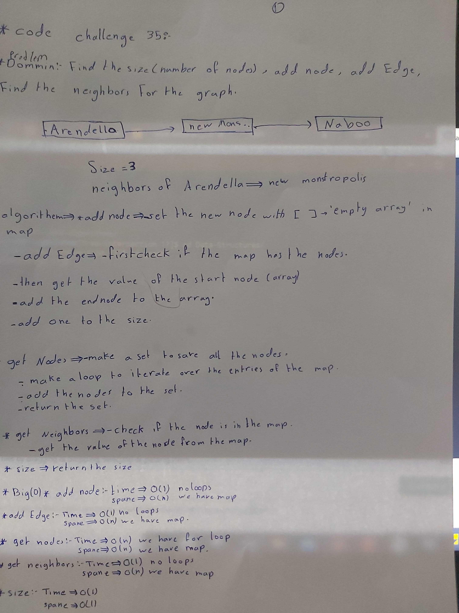

# data-structures-and-algorithms
Code challenges 401 - Data-Structures

# Implement a Hash Table class-35
This is about how to implement the Graph. The graph should be represented as an adjacency list, and should include the following methods:AddNode()/AddEdge()/GetNodes()/GetNeighbors()/Size().
## Challenge
Solve the challenge.
## Approach & Efficiency
This is about how to implement the Graph. The graph should be represented as an adjacency list, and should include the following methods:AddNode()/AddEdge()/GetNodes()/GetNeighbors()/Size()..

## [Action flow](https://github.com/Abdallah-401-advanced-javascript/data-structures-and-algorithms/pull/20/checks?check_run_id=748532367)

## Solution
<!-- [BLOG](./BLOG.md) -->

