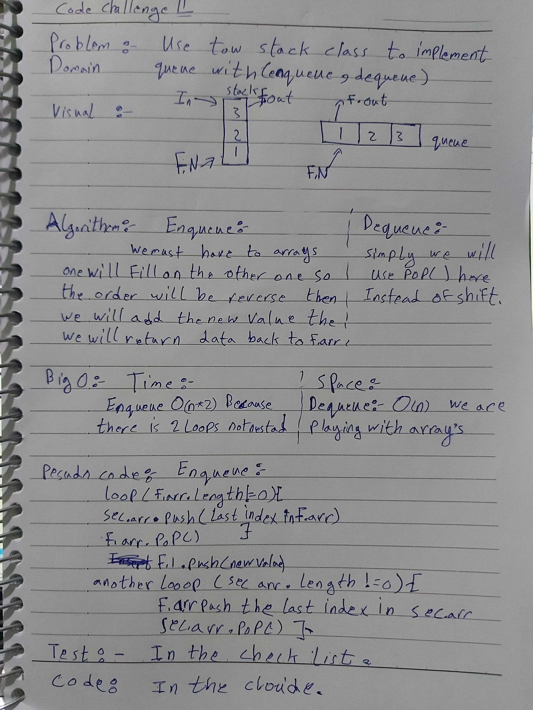

# data-structures-and-algorithms
Code challenges 401 - Data-Structures

# Implement a Queue using two Stacks-11
This is about how to utilize the tow Stacks to make a Queues data-structure methods using just these three methods (push/pop/peek).
## Challenge
Solve the challenge as a node(obj), but it was hard and no time for now maybe I could solve it in another time inshallah, for now its just array solution.
## Approach & Efficiency
Learn more about how the (Stacks and Queues) Data-Structures are realated to each other.

## 

<!-- why this error -->
## Solution

