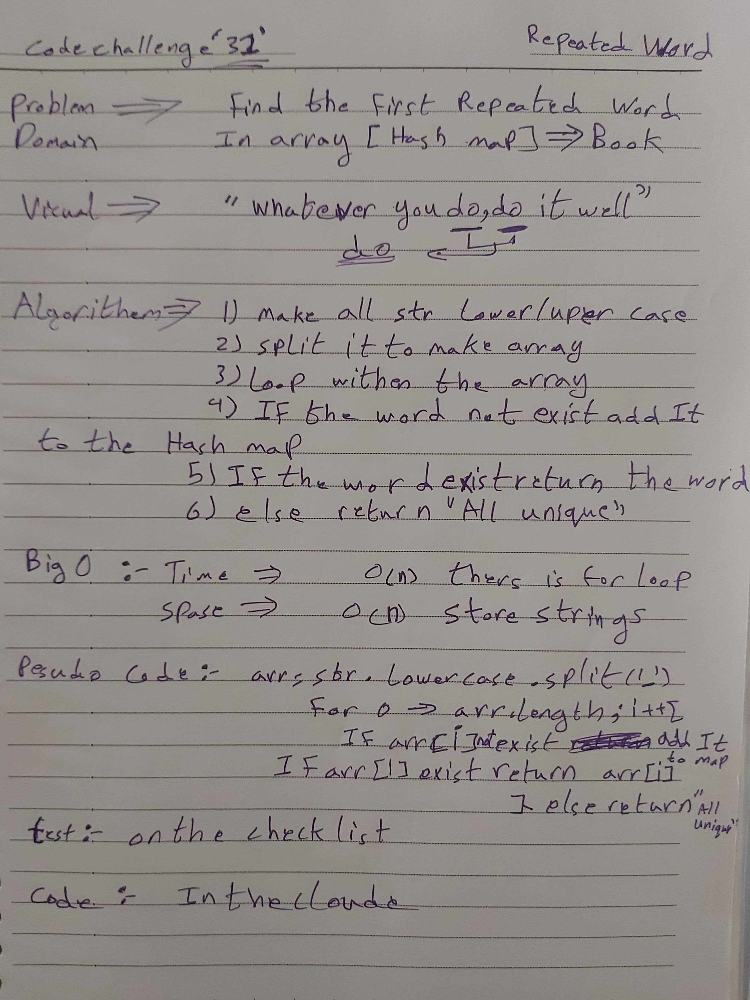

# data-structures-and-algorithms
Code challenges 401 - Data-Structures

# Implement a Hash Table class-31
This is about how to utilize the Hash Table Data-Structures to Find the first repeated word in a book.
## Challenge
Solve it as an object and as an Hash Table, and the part of handle the ',' withen the book
## Approach & Efficiency
Learn more about how to Find the first repeated word in a book.

## [Action flow](https://github.com/Abdallah-401-advanced-javascript/data-structures-and-algorithms/pull/20/checks?check_run_id=748532367)

## Solution
<!-- [BLOG](./BLOG.md) -->

