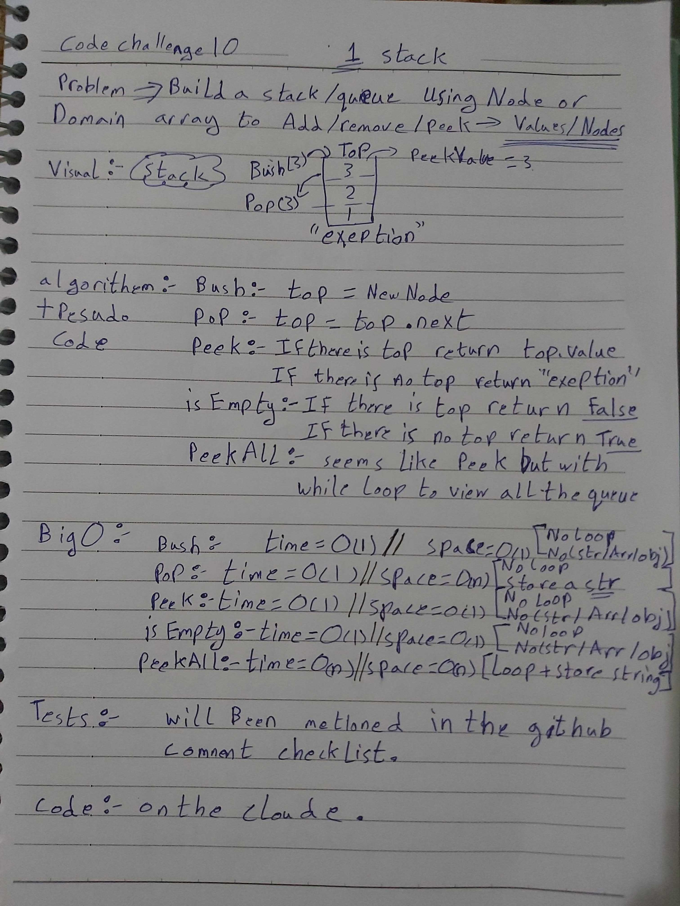
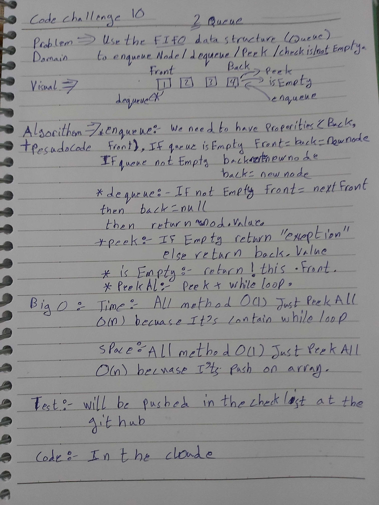

# data-structures-and-algorithms
Code challenges 401 - Data-Structures

# Stacks and Queues-10
This is about how to utilize the Stacks and Queues data-structure methods (push/pop/peek/isEmpty/encueue/dequeue).
## Challenge
Solve the challenge with O(1) space/time, using node once and array once.

## Approach & Efficiency
Learn how to use (Stacks and Queues) as Data-Structures.

## 

## Solution

