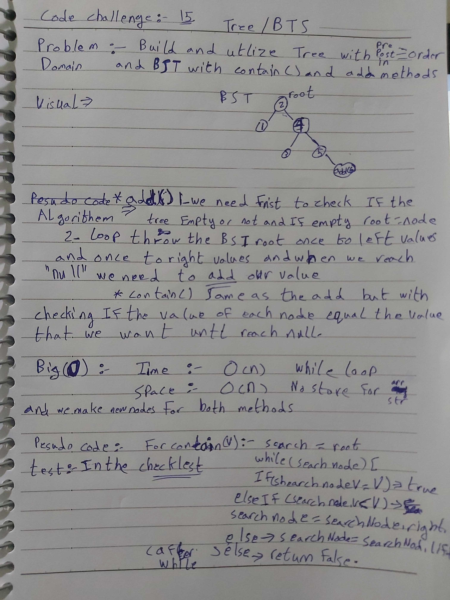

# data-structures-and-algorithms
Code challenges 401 - Data-Structures

# Binary Tree and BST Implementation-15
This is about how to utilize the Tree data-structure with (preOrder()/inOrde()/postOrder()) methods, and BST data-structure with (add()/contain()/max()) methods.
## Challenge
Solve the add max() methode to BST.
## Approach & Efficiency
Learn more about how the (Tree and BST) Data-Structures.
## 
## Solution

