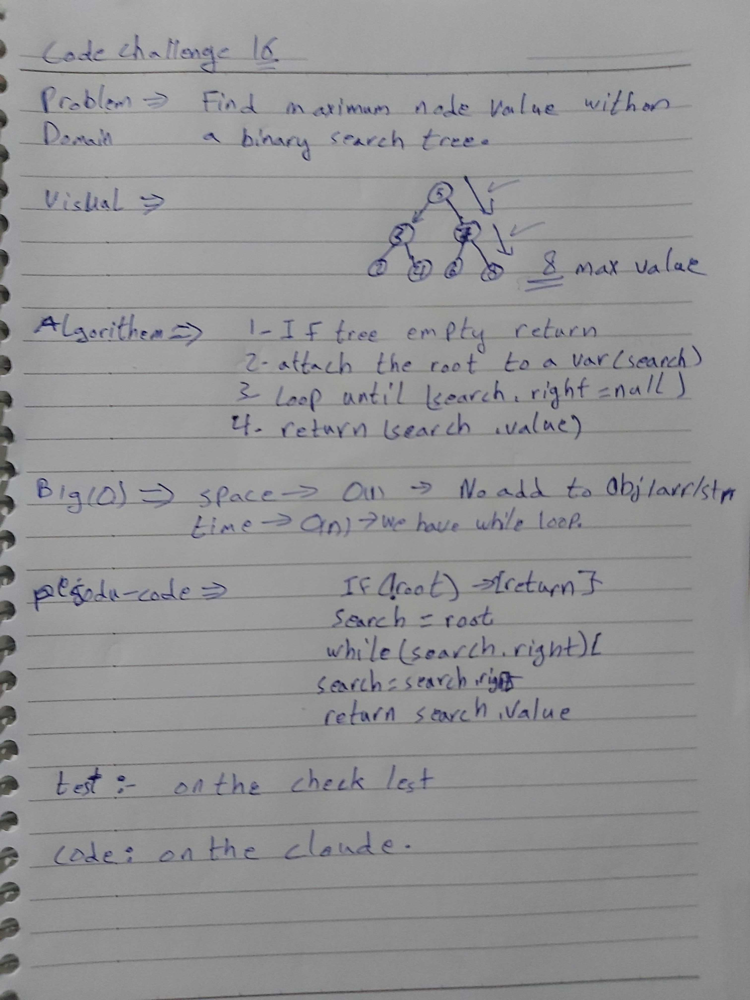

# Data-structures-and-algorithms
Code challenges 401 - Data-Structures

# Find the Maximum Value in a Binary Tree-15
This is about how to utilize the BST data-structure with (max-value()) methods.
## Challenge
Add max() methode to BST.
## Approach & Efficiency
Learn more about how the (Tree and BST) Data-Structures.
## 
## Solution

