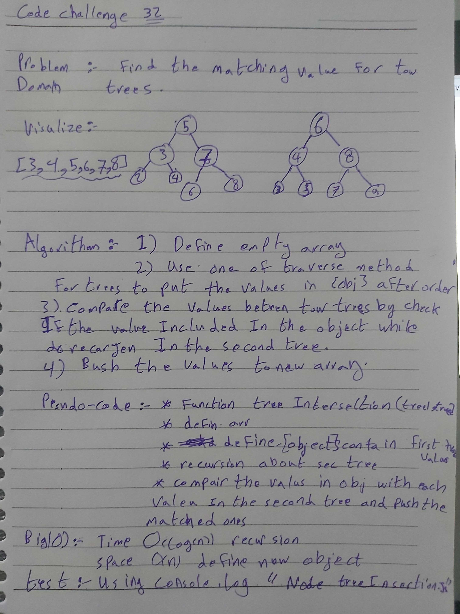

# Data-structures-and-algorithms
Code challenges 401 - Data-Structures

# Find the Maximum Value in a Find common values in 2 binary trees-32
This is about how to utilize the hash map data-structure to find common values in 2 binary trees.
## Challenge
keep the time complexity under O(log(n)).
## Approach & Efficiency
This is about how to utilize the hash map data-structure to find common values in 2 binary trees.
## 
## Solution

