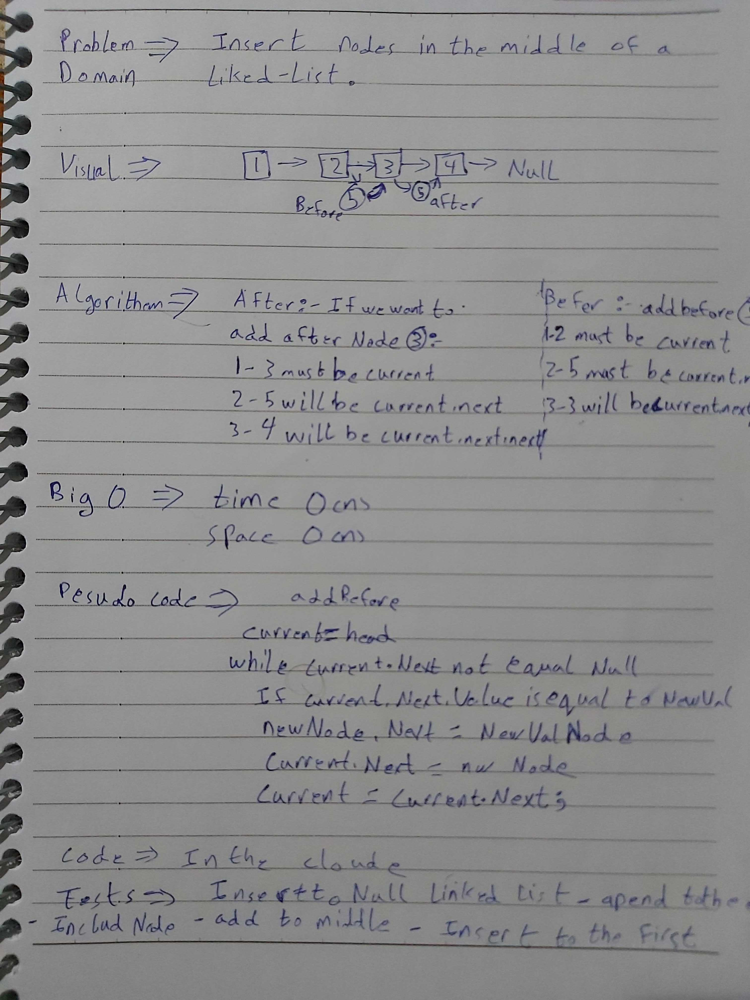

# data-structures-and-algorithms
Code challenges 401 - Data-Structures

# Linked List class-06
This is about how to utilize the linked list data-structure methods by appending a new node, insert a new node, include a new node, add special string, add node after/before another node.
## Challenge
Testing use the node and the node.next in the same time.

## Approach & Efficiency
Learn how to use (Linked List) as Data-Structures.

## 

## Solution
