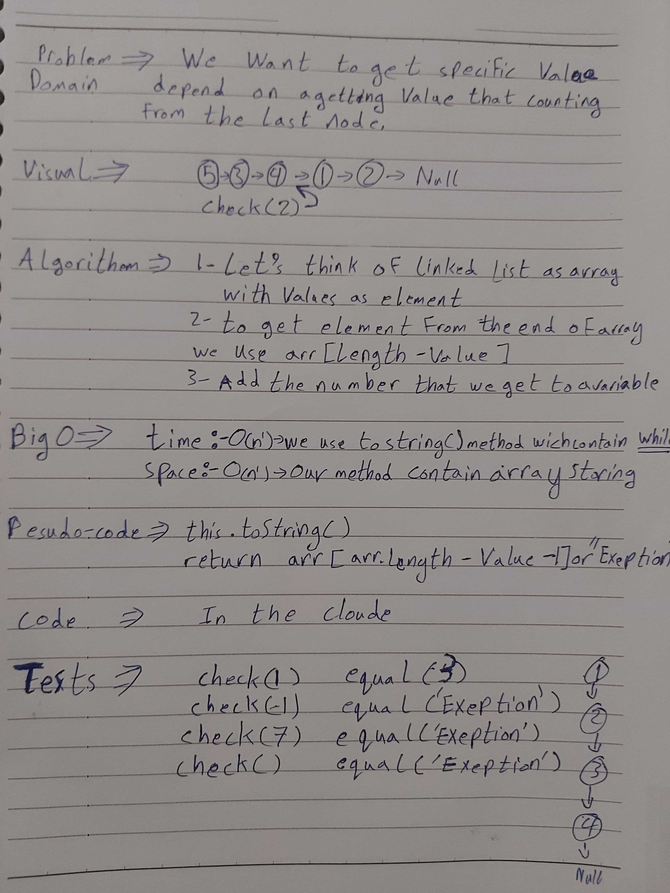

# data-structures-and-algorithms
Code challenges 401 - Data-Structures

# Linked List Class-07
This is about how to utilize the linked list data-structure methods by getting a specific node by value "count from the end", then return that node value.

## Challenge
Testing uses the node and the node.next at the same time and return an exception if value not found.

## Approach & Efficiency
Learn how to use (Linked List) as Data-Structures.

## 

## Solution
