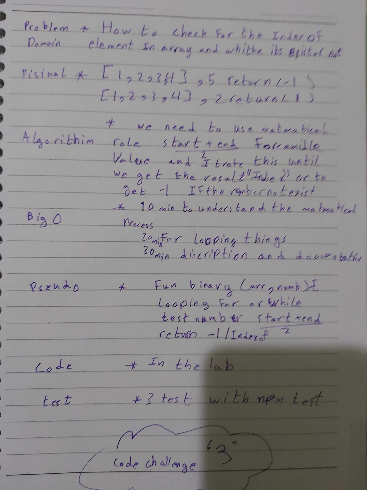

# data-structures-and-algorithms
Code challenges 401

# Insert Shift Array
This challenge is about (array-binary-search), by check the index for the element and either or exist or not in the array.
## Challenge
Showing -1 if the element does not exist in the array.

## Approach & Efficiency
Learn how to do (array-binary-search) for any array.

##

## Solution
