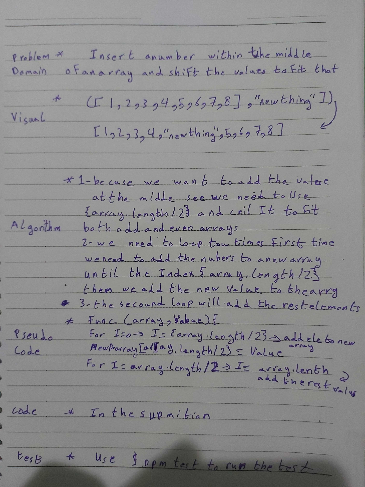

# data-structures-and-algorithms
Code challenges 401

# Insert Shift Array
This challenge is about (Insert/Shift) array elements, whatever the tall of it, and without using built-in functions.
## Challenge
Our function should accept both even and odd arrays.

## Approach & Efficiency
Learn how to (Insert/Shift) an array in different ways.

## Solution
