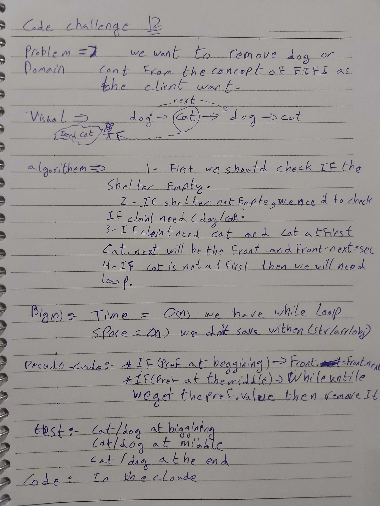

# data-structures-and-algorithms
Code challenges 401 - Data-Structures

# First-in, First out Animal Shelter-12
This is about how to utilize the Queues to make animals in a shelter first in first out.
## Challenge
Solve the challenge with O(1) space.

## Approach & Efficiency
Learn more about uses of queue.

## 

## Solution

