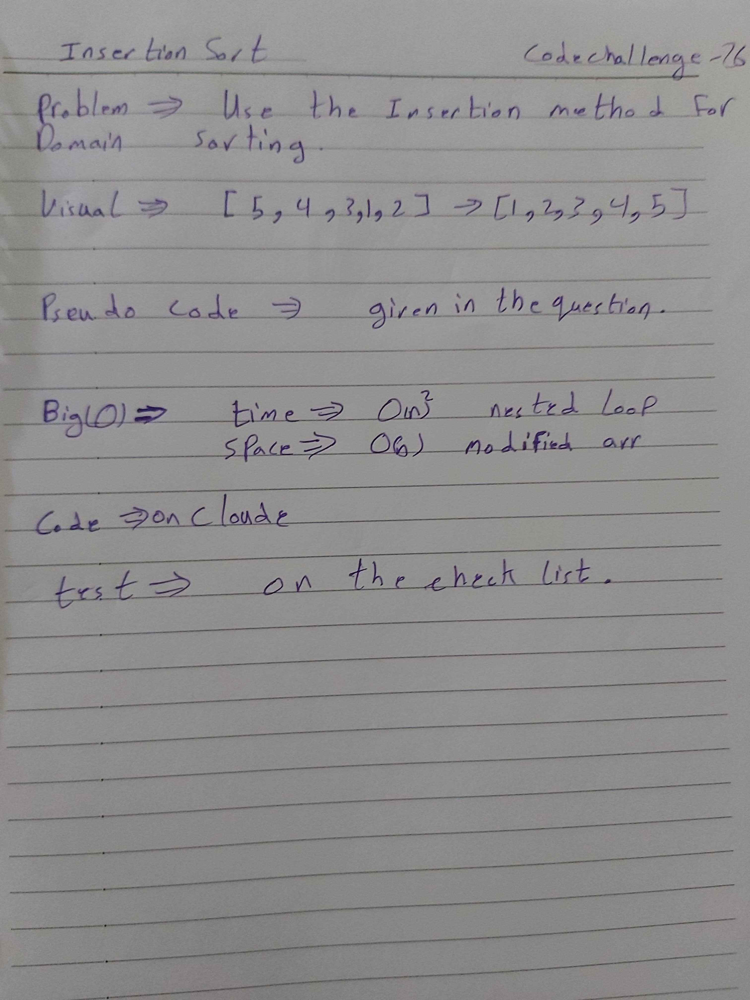

# data-structures-and-algorithms
Code challenges 401 - Data-Structures

# Implement a Queue using two Stacks-16
This is about how to utilize the insertion sort to sort a array.
## Challenge
Solve the challenge.
## Approach & Efficiency
Learn more about how the insertion sort.

## 

## Solution

