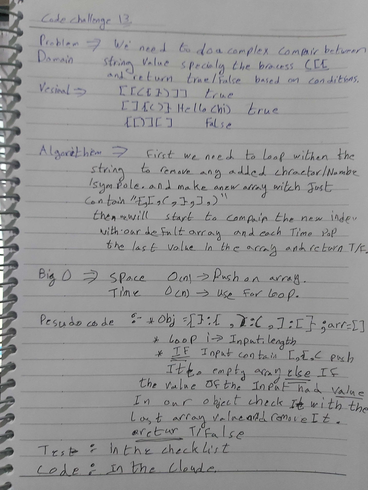

# data-structures-and-algorithms
Code challenges 401 - Data-Structures

# Implement a Multi-bracket Validation-13
This is about how to do compare a set of values in a string or array with specific conditions.
## Challenge
how to shorten the code without affecting the Big O.
## Approach & Efficiency
How to build complex compare between string or array value.

## 

## Solution

