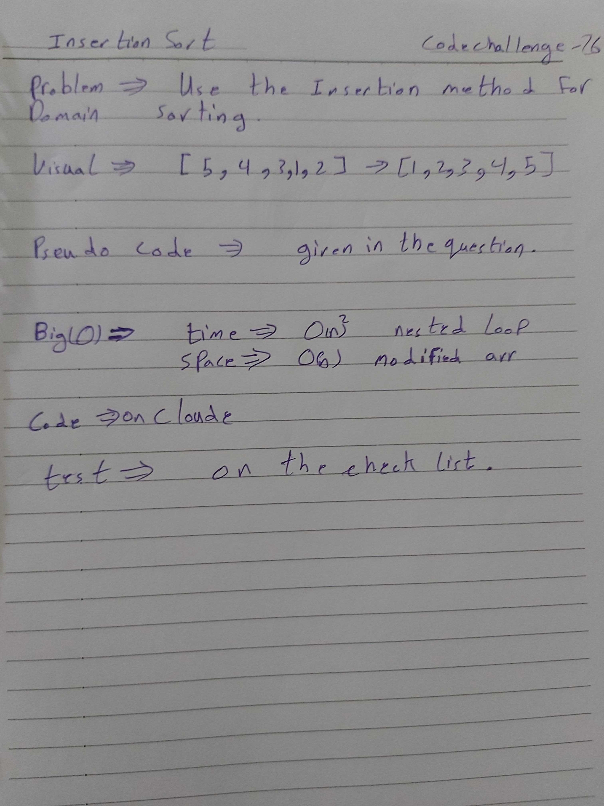

# data-structures-and-algorithms
Code challenges 401 - Data-Structures

# Implement a Quick Sort class-28
This is about how to utilize the Quick Sort to sort an array.
## Challenge
Solve the challenge.
## Approach & Efficiency
Learn more about how to use Quick Sort to sort an array..

## [Action flow](https://github.com/Abdallah-401-advanced-javascript/data-structures-and-algorithms/pull/20/checks?check_run_id=748532367)

## Solution
[BLOG](./BLOG.md)
<!--  -->

